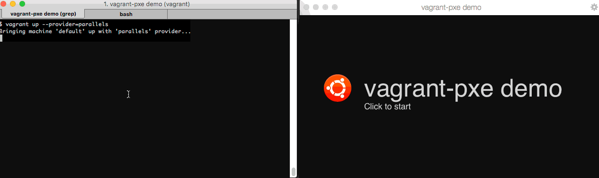

Vagrant PXE
===========

This Vagrantfile configures a Virtual Machine to be a PXE server using DNSMasq.
It will NOT replace an existing DHCP server in your network, instead it is a DHCP proxy.

Please keep in mind the following:
> Warning! Vagrant boxes are insecure by default and by design, featuring public passwords, insecure keypairs for SSH access, and potentially allow root access over SSH. With these known credentials, your box is easily accessible by anyone on your network.

(Source: https://docs.vagrantup.com/v2/networking/public_network.html)

The folder PXE will be the TFTP-server root.

Requirements
------------

- Vagrant
- librarian-puppet `gem install librarian-puppet`
- vagrant-librarian-puppet `vagrant plugin install vagrant-librarian-puppet`
- DHCP server in your network
- (optional) OS that supports shared folders over NFS (OS X, Linux). Should fall back to default mechanism on Windows.

Example
-------
How to let PXE clients boot the Ubuntu Linux 14.04 LTS?
Extract [netboot.tar.gz](http://archive.ubuntu.com/ubuntu/dists/trusty-updates/main/installer-amd64/current/images/netboot/) to /pxe and go.

**new in 1.1.0:** You can also run [scripts/download_xenial_netboot.sh](scripts/download_xenial_netboot.sh) to download and extract the required files for a Ubuntu 16.04 netboot.

Troubleshooting
---------------
Make sure the VM gets connected to your existing network instead to the NAT or host-only network.

License
-------
MIT
